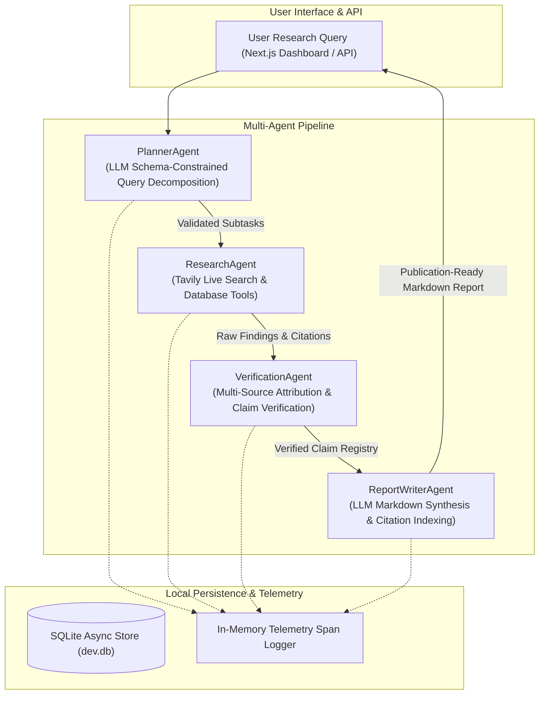

# Enterprise Multi-Agent Research System

An autonomous, self-contained multi-agent research platform that orchestrates four specialized agents—Planner, Researcher, Verifier, and Report Writer. It decomposes complex research questions into structured subtasks, retrieves factual information using web search and internal tools, verifies claims with source-attribution scoring, and synthesizes publication-ready Markdown reports with inline citations linked to a complete bibliography.

This project is **100% standalone** and operates independently with direct LLM provider integrations, local SQLite persistence, and built-in telemetry tracking.

---

## Architecture



### Agent Roles:
1. **PlannerAgent**: Accepts natural language research queries and generates a validated, prioritized list of structured sub-tasks (`PlannerSubTask`) using JSON-mode LLM generation.
2. **ResearchAgent**: Executes each subtask concurrently by querying live Tavily Web Search and local database query tools, outputting structured `ResearchFinding` objects.
3. **VerificationAgent**: Analyzes extracted findings to confirm multi-source attribution, ensuring high-confidence claim support before report generation.
4. **ReportWriterAgent**: Synthesizes verified findings into an executive Markdown report with numbered citations (`[1]`, `[2]`) linked to an indexed bibliography table.

---

## Tech Stack

- **Backend**: Python 3.12, FastAPI, Uvicorn, Pydantic v2, HTTPX, SQLite / aiosqlite, Qdrant Client (`qdrant-client`).
- **Frontend**: Next.js 14 (App Router), React 18, TypeScript, Tailwind CSS, Lucide Icons.
- **LLM / Tool Integration**: Groq API (`llama-3.3-70b-versatile`), Tavily Web Search API.

---

## Directory Structure

```
├── backend/
│   ├── app/
│   │   ├── agents/
│   │   │   ├── planner.py         # PlannerAgent implementation
│   │   │   ├── researcher.py      # ResearchAgent implementation
│   │   │   ├── verifier.py        # VerificationAgent implementation
│   │   │   └── report_writer.py   # ReportWriterAgent implementation
│   │   ├── clients/
│   │   │   ├── router_client.py   # Direct LLM completion client
│   │   │   ├── mcp_client.py      # Standalone tool executor
│   │   │   └── obs_client.py      # Telemetry span recorder
│   │   ├── core/
│   │   │   ├── config.py          # Environment settings
│   │   │   ├── errors.py          # Custom exception handlers
│   │   │   └── logging.py         # Structured JSON logging
│   │   ├── eval/
│   │   │   └── multiagent_eval.py # 20-query evaluation harness
│   │   ├── database.py            # SQLite async database
│   │   └── main.py                # FastAPI endpoints (/api/planner, /api/research)
│   ├── tests/
│   │   ├── test_phase1.py         # PlannerAgent tests
│   │   ├── test_phase2.py         # Research & verification tests
│   │   ├── test_phase3.py         # Report writer tests
│   │   └── test_phase4.py         # Circuit breaker & fallback tests
│   ├── .env.sample                # Sample environment template
│   └── pyproject.toml             # Python dependencies
├── frontend/
│   ├── app/
│   │   ├── layout.tsx             # Root layout
│   │   ├── page.tsx               # Multi-Agent Research Dashboard UI
│   │   └── globals.css            # Tailwind styling
│   ├── package.json               # Node.js dependencies
│   └── tailwind.config.js         # Tailwind configuration
└── README.md                      # Project documentation
```

---

## Prerequisites

- **Python 3.12+** and `uv` package manager
- **Node.js 18+** and `npm`
- **API Keys**:
  - `TAVILY_API_KEY`: Required for live web research. Get one at [tavily.com](https://tavily.com).
  - `LLM_API_KEY` (or `GROQ_API_KEY`): Groq API key for fast LLM generation. Get one at [groq.com](https://groq.com).

---

## Environment Variables (.env)

Create a file named `.env` inside `backend/`:

```env
PORT=8001
HOST=0.0.0.0
DATABASE_URL=sqlite+aiosqlite:///./dev.db
QDRANT_URL=:memory:
TAVILY_API_KEY=tvly-your-actual-tavily-key
LLM_API_KEY=gsk_your-actual-groq-api-key
```

---

## Setup & Running Guide

### 1. Backend Setup
```bash
# Navigate to backend directory
cd backend

# Create virtual environment and install dependencies
uv venv
# On Windows (PowerShell):
.venv\Scripts\activate
# On Linux/macOS:
source .venv/bin/activate

uv sync

# Start the FastAPI server (Port 8001)
uv run uvicorn app.main:app --port 8001 --reload
```

### 2. Frontend Setup
```bash
# Open a new terminal and navigate to frontend directory
cd frontend

# Install dependencies
npm install

# Start Next.js development server on Port 3001
npm run dev -- -p 3001
```

Access the UI at: **`http://localhost:3001`**

---

## Manual Testing Walkthrough

1. Open `http://localhost:3001` in your browser.
2. In the query box, enter:
   ```
   What are the latest breakthroughs in solid-state battery technology and commercialization timelines?
   ```
3. Click **"Run Research Pipeline"**.
4. **Expected Output**:
   - **Sub-Tasks**: Planner decomposes the query into 3 structured research subtasks.
   - **Findings**: Researcher gathers live web information via Tavily and database tools.
   - **Verification**: Verifier scores each finding for claim support and attribution.
   - **Executive Report**: Report Writer outputs a full Markdown report with numbered citations `[1]`, `[2]` and a complete Bibliography table.

---

## Automated Tests & Evaluation

### Run Test Suite (12 tests)
```bash
cd backend
uv run pytest -v
```

### Run Multi-Agent Evaluation Harness (20 test queries)
```bash
cd backend
uv run python -m app.eval.multiagent_eval
```
