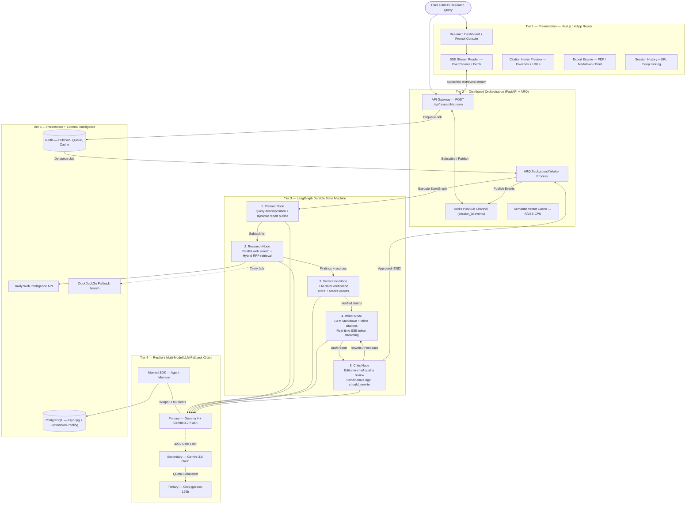
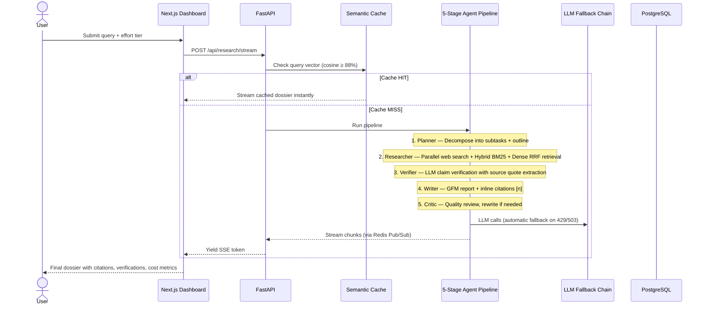

<div align="center">
<br>

<h1>Deep Research AI Engine</h1>
<p><b>Autonomous Multi-Agent Deep Research &amp; Intelligence Synthesis Platform</b><br/>
<i>Decompose complex inquiries → crawl live web intelligence → verify claims against source evidence → synthesize publication-grade Markdown dossiers with real-time SSE streaming.</i></p>
<p>
  <a href="https://python.org"></a>
  <a href="https://fastapi.tiangolo.com"></a>
  <a href="https://nextjs.org"></a>
  <a href="https://www.typescriptlang.org"></a>
  <a href="https://ai.google.dev"></a>
  <a href="https://groq.com"></a>
  <a href="https://tavily.com"></a>
  <a href="https://upstash.com"></a>
  <a href="LICENSE"></a>
</p>
<p>
  <a href="#-executive-overview"><b>Overview</b></a>&nbsp;&nbsp;·&nbsp;&nbsp;
  <a href="#-system-architecture"><b>Architecture</b></a>&nbsp;&nbsp;·&nbsp;&nbsp;
  <a href="#-agent-pipeline-deep-dive"><b>Agent Pipeline</b></a>&nbsp;&nbsp;·&nbsp;&nbsp;
  <a href="#-engineering-highlights"><b>Engineering Highlights</b></a>&nbsp;&nbsp;·&nbsp;&nbsp;
  <a href="#-quick-start"><b>Quick Start</b></a>&nbsp;&nbsp;·&nbsp;&nbsp;
  <a href="#-api-reference"><b>API Reference</b></a>
</p>
</div>

---

## 📖 Executive Overview

Traditional search engines return fragmented, SEO-optimized results that demand hours of manual synthesis. Standard LLM interfaces hallucinate citations, fabricate metrics, and lack access to live data.

**Deep Research AI Engine** eliminates both failure modes. Given a complex research prompt, it orchestrates **five specialized AI agents** — Planner, Researcher, Verifier, Critic, and Report Writer — that autonomously decompose the inquiry, scrape live web intelligence, verify claims against raw source evidence, critique draft quality, and synthesize publication-grade research dossiers with verifiable inline citations.

The entire pipeline runs asynchronously and streams every event — from subtask dispatch to token-by-token markdown authoring — to a Next.js 14 interface over **Server-Sent Events (SSE)**. The platform features fault-tolerant parallel workers, a multi-model LLM fallback chain with automatic 429 retry, exact provider-reported token metering, SSRF-hardened URL fetching, and sub-200ms semantic vector caching.

---

## 🏗️ System Architecture



---

## 🔬 Agent Pipeline Deep Dive



### Agent Responsibilities

| Agent | File | Role |
|:---|:---|:---|
| **Planner** | `app/agents/planner.py` | Decomposes query into prioritized subtasks and generates a dynamic, domain-specific report outline tailored to the subject matter |
| **Researcher** | `app/agents/researcher.py` | Dispatches parallel web searches via Tavily (+ DuckDuckGo fallback). Cleans and chunks scraped content, then ranks passages with **Hybrid BM25 + Dense Vector RAG** — BM25 lexical scores fused with Gemini embedding cosine similarity via Reciprocal Rank Fusion (RRF). Falls back to BM25-only if the embedding API is unavailable. |
| **Verifier** | `app/agents/verifier.py` | LLM-based claim verifier. Evaluates each claim against raw source context, assigns an entailment score (0.0–1.0), and extracts verbatim supporting quotes. Unverified claims are flagged to the writer |
| **Writer** | `app/agents/report_writer.py` | Synthesizes verified findings into GitHub Flavored Markdown with inline citations `[1]`, `[2]`. Streams tokens to frontend in real-time |
| **Critic** | `app/agents/critic.py` | Editor-in-Chief quality gate. Evaluates completeness, citation density, and outline coverage. Triggers automated rewrite loop if report is insufficient |

---

## 🏗️ System Design & Interview Trade-Offs

When scaling this system, several key architectural decisions were made to prioritize reliability, cost-control, and horizontal scaling over pure theoretical autonomy:

1.  **Why a LangGraph State Machine over a Pure ReAct Agent?**
    *   *Trade-off:* A pure ReAct agent (Tool Node + LLM loop) can dynamically choose from a massive registry of tools, but it is notoriously prone to infinite loops and massive token bloat when reasoning breaks down. 
    *   *Decision:* We use a **Flow Engineering** approach (LangGraph `StateGraph`). The high-level path is deterministic (Plan → Research → Verify → Write), ensuring predictable latency and bounded LLM costs. The *dynamism* is explicitly constrained to the Critic's conditional feedback loop (`should_rewrite`), providing the perfect balance of autonomous self-correction and production stability.

2.  **Why ARQ & Redis Pub/Sub instead of In-Memory Async Tasks?**
    *   *Trade-off:* Python `asyncio` tasks with in-memory queues are easy to build but fail instantly if the web server process restarts, dropping all active user sessions.
    *   *Decision:* We fully decoupled the API gateway from task execution. The FastAPI endpoint enqueues a job into an **ARQ** Redis queue. A separate worker process pulls the job, executes the LangGraph state machine, and streams events back to a **Redis Pub/Sub** channel. The FastAPI server simply subscribes to this channel. You can scale the web servers and the LLM workers completely independently.

3.  **Why Reciprocal Rank Fusion (RRF) for Verification?**
    *   *Trade-off:* Relying solely on Vector/Semantic search can miss exact keyword matches (e.g., specific model numbers or names), while BM25 misses semantic intent.
    *   *Decision:* The Verification node runs both BM25 and Dense Vector embeddings in parallel, fusing the results via RRF. This ensures the strictest possible verification tagging—if a claim isn't grounded in the hybrid retrieved context, it is explicitly flagged as `[UNVERIFIED]`.

---

## 🚀 Engineering Highlights

### Fault-Tolerant Parallel Workers
Individual subtask failures don't crash the pipeline. Failed workers produce empty-source findings with explicit failure messages, ensuring the remaining research completes and unverified claims are clearly flagged in the report.

### Multi-Model LLM Fallback with 429 Retry
Requests route through Gemma 4 → Gemini 3.7 Flash → Gemini 3.5 Flash → Groq. On `429 Rate Limit` or `RESOURCE_EXHAUSTED`, exponential backoff retries up to 3 attempts before failing over to the next provider.

### Exact Provider-Reported Token Metering
Token counts come directly from Google GenAI `response.usage_metadata` and Groq `response.usage` — **zero heuristic estimation**. Cost is calculated using official per-model pricing rates via a `contextvars.ContextVar` callback that accumulates usage across all pipeline stages.

### Semantic Vector Cache
Queries are embedded and evaluated against Upstash Redis + FAISS using cosine similarity. Queries with **≥ 88% similarity** return pre-computed dossiers without re-running the full pipeline. The FAISS index is maintained in-memory with a single cold-start load from Redis; subsequent lookups are pure in-memory vector search.

### Hybrid BM25 + Dense Retrieval
Within each research subtask, scraped page content is split into 500-char overlapping chunks. Each chunk is scored by both **BM25** (lexical keyword overlap) and **Gemini dense embeddings** (semantic cosine similarity). The two rank lists are fused with **Reciprocal Rank Fusion (RRF, k=60)** to select the top-3 passages passed to the LLM synthesiser. If the embedding API is rate-limited, the pipeline degrades gracefully to BM25-only without interrupting research.

### SSRF-Hardened URL Fetching
All outbound URL requests are validated against RFC 1918 private ranges, loopback addresses, link-local, and cloud metadata endpoints (AWS `169.254.169.254`, GCP `metadata.google.internal`).

### Database Connection Pooling
PostgreSQL connections use SQLAlchemy async pooling (`pool_size=10`, `max_overflow=20`, `pool_recycle=1800`, `pool_pre_ping=True`) for high-throughput concurrent research sessions.

### Rate Limiting
Per-user and per-IP request throttling via Redis-backed sliding window counters with in-memory fallback when Redis is unavailable.

### Groundedness Score
Computed from LLM entailment scores across all verified claims. Unverified claims (score 0.0) are flagged to the writer with explicit `[UNVERIFIED]` annotations. Displayed as a percentage badge in the frontend alongside token usage and cost metrics.

### Server-Side PDF Export
Backend PDF generation via ReportLab with Markdown-to-PDF conversion (tables, headings, citations). Frontend also supports client-side export via `html2canvas` + `jsPDF`.

### Decoupled Background Execution
Research runs as detached `asyncio.Task` background jobs via the `ActiveJob` pub-sub system. Every SSE event is persisted to PostgreSQL so users can refresh, disconnect, and reconnect — even after a server restart — without losing progress. Multiple clients can subscribe to the same job simultaneously.

### Database Migrations
Alembic migration scripts for PostgreSQL schema evolution without data loss.

---

## 🎚️ Effort Tiers

| Tier | Subtasks | Search Depth | Gap Analysis | Retrieval | Verification | Typical Latency |
|:---|:---:|:---:|:---:|:---:|:---:|:---:|
| **Low** | 1–2 | Basic | No | Hybrid BM25+Dense | Core claim check | 15–30s |
| **Medium** | 2–4 | Advanced | No | Hybrid BM25+Dense | Full LLM entailment | 45–75s |
| **High** | 4–7 | Multi-query | Yes (Depth-2) | Hybrid BM25+Dense | Strict quote extraction | 90–180s |

---

## ⚡ Quick Start

### 1. Clone

```bash
git clone https://github.com/LaxmiNarayana31/agentic-research-engine.git
cd agentic-research-engine
```

### 2. Backend

```bash
cd backend
uv venv
uv sync

# Configure environment
cp .env.sample .env
# Fill in API keys (see Environment Variables below)

# Start server
uv run uvicorn main:app --port 8001 --reload
```

### 3. Frontend

```bash
cd frontend
npm install
npm run dev
```

Open **http://localhost:3001** — API docs at **http://localhost:8001/docs**.

### 4. Docker Compose (Alternative)

```bash
# Copy .env to backend/.env with your API keys first
docker compose up --build
```

This starts Redis, backend (port 8001), and frontend (port 3001) with health checks and automatic dependency ordering.

---

## 🔐 Environment Variables

### Backend (`backend/.env`)

```bash
# PostgreSQL (https://console.aiven.io)
DB_USER=
DB_PASSWORD=
DB_HOST=
DB_PORT=5432
DB_NAME=
SSL_MODE=require

# Tavily Search (https://app.tavily.com/home)
TAVILY_API_KEY=

# Groq LLM (https://console.groq.com/keys)
GROQ_API_KEY=

# Google Gemini (https://aistudio.google.com/apikey)
GEMINI_API_KEY=

# Memori Agent Memory (https://app.memorilabs.ai/api-keys)
MEMORI_API_KEY=

# Upstash Redis (https://console.upstash.com/redis)
REDIS_URL=

# Google OAuth (https://console.cloud.google.com/apis/credentials)
GOOGLE_CLIENT_ID=

# JWT Secret — REQUIRED (min 32 chars)
# Generate with: python -c "import secrets; print(secrets.token_hex(32))"
JWT_SECRET_KEY=

# CORS — comma-separated trusted frontend origins
# Example: ALLOWED_ORIGINS=http://localhost:3001,https://yourdomain.com
ALLOWED_ORIGINS=http://localhost:3001
```

### Frontend (`frontend/.env.local`)

```bash
NEXT_PUBLIC_API_URL=http://localhost:8001
```

---

## 📡 API Reference

### Research Endpoints (`/api/research`)

| Method | Endpoint | Description |
|:---:|:---|:---|
| `POST` | `/stream` | Primary SSE endpoint. Runs full 5-stage pipeline with real-time streaming |
| `POST` | `/chat/stream` | Lightweight conversational chat mode (direct LLM response) |
| `POST` | `/` | Synchronous pipeline. Returns complete `ResearchPipelineResponse` JSON |
| `POST` | `/planner` | Planner-only. Decomposes query into subtasks without executing searches |
| `GET` | `/stream/{session_id}/subscribe` | Reconnect to an active or past research session |
| `POST` | `/{session_id}/cancel` | Cancel an active research job |
| `GET` | `/history` | List past research sessions |
| `GET` | `/history/{session_id}` | Full session detail with findings, verifications, and report |
| `DELETE` | `/history/{session_id}` | Delete a research session |
| `GET` | `/{session_id}/export/pdf` | Export session report as PDF |
| `GET` | `/suggestions` | Dynamic trending research topic suggestions via LLM |

### Auth Endpoints (`/api/auth`)

| Method | Endpoint | Description |
|:---:|:---|:---|
| `POST` | `/signup` | Email/password registration |
| `POST` | `/login` | Email/password authentication |
| `POST` | `/google` | Google OAuth sign-in |
| `POST` | `/refresh` | Refresh JWT token |
| `GET` | `/me` | Current user profile |
| `GET` | `/config` | Auth configuration (Google Client ID) |
| `GET` | `/workspaces` | List user workspaces |
| `POST` | `/workspaces` | Create new workspace |
| `GET` | `/usage` | User usage statistics |

### Health

| Method | Endpoint | Description |
|:---:|:---|:---|
| `GET` | `/health` | Server uptime and timestamp |

---

## 🧪 Testing

```bash
cd backend
uv run pytest -v
```

**Test suites:**

| Suite | Coverage |
|:---|:---|
| `test_performance_and_resilience.py` | Fault-tolerant workers, connection pooling, 429 retry, SSRF guard, groundedness score, exact token metering |
| `test_cancellation_and_search_resilience.py` | Job cancellation, search provider failover |
| `test_multi_tenancy.py` | User/tenant isolation, workspace scoping |
| `test_pdf_and_stream_resilience.py` | PDF export, SSE stream resilience |
| `test_auth.py` | JWT auth, Google OAuth, token refresh |
| `test_dtos.py` | Pydantic model validation |
| `test_rate_limiter.py` | Rate limiting guard |
| `test_semantic_cache.py` | Vector cosine similarity |
| `test_health.py` | Health endpoint |

GitHub Actions CI/CD (`.github/workflows/ci.yml`) runs backend `pytest` and frontend `next build` on every push.

---

## 📂 Project Structure

```
├── backend/
│   ├── app/
│   │   ├── agents/          # Planner, Researcher, Verifier, Writer, Critic
│   │   ├── api/             # FastAPI route handlers (research + auth)
│   │   ├── clients/         # MultiModelLLMClient with fallback chain
│   │   ├── core/            # Config, logging, error handling
│   │   ├── db/              # SQLAlchemy async engine + connection pooling
│   │   ├── dtos/            # Pydantic request/response schemas
│   │   ├── helpers/         # Auth helpers, utilities
│   │   ├── models/          # SQLAlchemy ORM models
│   │   └── services/        # ResearchService, SemanticCache, RateLimiter, PDF Export
│   ├── alembic/             # Database migrations
│   ├── tests/               # pytest test suites
│   ├── main.py              # FastAPI application entrypoint
│   ├── Dockerfile
│   └── pyproject.toml
├── frontend/
│   ├── app/
│   │   ├── components/      # React components (ChatTurnView, SourceGrid, etc.)
│   │   ├── types/           # TypeScript interfaces
│   │   ├── utils/           # Citation processing, helpers
│   │   └── page.tsx         # Main research dashboard
│   ├── Dockerfile
│   └── package.json
├── docker-compose.yml        # Full-stack containerized deployment
└── README.md
```

---

## 🤝 Contributing

1. Fork the Project
2. Create your Feature Branch (`git checkout -b feature/AmazingFeature`)
3. Commit your Changes (`git commit -m 'Add AmazingFeature'`)
4. Push to the Branch (`git push origin feature/AmazingFeature`)
5. Open a Pull Request

---

## 📄 License

Distributed under the **MIT License**. See [`LICENSE`](LICENSE) for details.