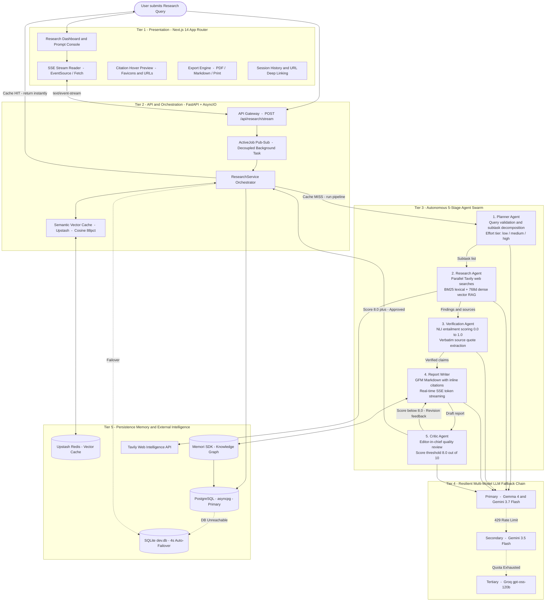
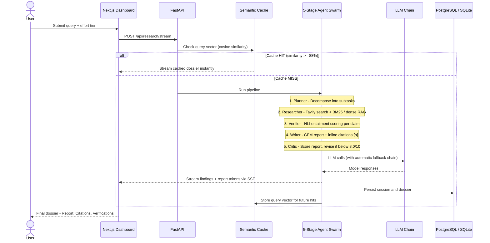

<div align="center">
<br>

<h1>Deep Research AI Engine</h1>
<p><b>Autonomous Multi-Agent Deep Research &amp; Intelligence Synthesis Platform</b><br/>
<i>Decomposing complex inquiries, crawling live web intelligence, verifying factual claims with NLI entailment, and synthesizing publication-grade Markdown dossiers with real-time SSE streaming.</i></p>
<p>
  <a href="https://python.org"></a>
  <a href="https://fastapi.tiangolo.com"></a>
  <a href="https://nextjs.org"></a>
  <a href="https://www.typescriptlang.org"></a>
  <a href="https://ai.google.dev"></a>
  <a href="https://groq.com"></a>
  <a href="https://tavily.com"></a>
  <a href="https://upstash.com"></a>
  <a href="LICENSE"></a>
</p>
<p>
  <a href="#-executive-overview"><b>Executive Overview</b></a>&nbsp;&nbsp;·&nbsp;&nbsp;
  <a href="#-system-architecture"><b>System Architecture</b></a>&nbsp;&nbsp;·&nbsp;&nbsp;
  <a href="#-architecture-deep-dive--data-flow"><b>Architecture Deep Dive</b></a>&nbsp;&nbsp;·&nbsp;&nbsp;
  <a href="#-how-the-agent-pipeline-works"><b>Agent Pipeline</b></a>&nbsp;&nbsp;·&nbsp;&nbsp;
  <a href="#-effort-tiers--depth-calibration"><b>Effort Tiers</b></a>&nbsp;&nbsp;·&nbsp;&nbsp;
  <a href="#-environment-variables-guide"><b>Environment Variables</b></a>&nbsp;&nbsp;·&nbsp;&nbsp;
  <a href="#-quick-start"><b>Quick Start</b></a>&nbsp;&nbsp;·&nbsp;&nbsp;
  <a href="#-api-reference"><b>API Reference</b></a>
</p>
</div>

---

## 📖 Executive Overview

Modern technical and scientific research workflows suffer from two fundamental problems: traditional search engines return fragmented, SEO-optimized listicles that require hours of manual collation, while standard Large Language Model (LLM) interfaces hallucinate plausible-sounding facts, fabricate citations, and lack access to live technical documentation.

**Deep Research AI Engine** is an open-source autonomous intelligence platform designed to eliminate these failure modes. Given a complex, high-level research prompt, the engine orchestrates a decentralized team of five specialized AI agents—**Planner**, **Researcher**, **Verifier**, **Critic**, and **Report Writer**—that autonomously decompose the inquiry, scrape and index live web intelligence, verify claims against raw textual evidence, critique draft quality, and synthesize publication-grade research dossiers complete with verifiable inline citations and comprehensive bibliographies.

The entire orchestration runs asynchronously in the background and streams every event—from subtask dispatch to token-by-token markdown authoring—to a modern Next.js 14 web interface over Server-Sent Events (SSE). Designed for resilience, the platform features a multi-model LLM fallback chain, automatic PostgreSQL-to-SQLite database failover, and sub-200ms semantic vector caching powered by Upstash Redis.

---

## 🏗️ System Architecture

The platform follows a clean, decoupled 5-tier architecture that separates presentation, orchestration, agent intelligence, multi-model routing, and persistent storage.



---

## 🔍 Architecture Deep Dive & Data Flow

To understand how high-throughput, multi-agent intelligence is generated, let us examine the responsibilities and interaction mechanics of each architectural layer:

### 1. Presentation Tier (Next.js 14 App Router)
The frontend provides a real-time, reactive research workspace. When a researcher submits a query, the client opens an asynchronous `EventSource` / `fetch` readable stream connected to `POST /api/research/stream`. The UI uses Framer Motion to update the 5-stage agent stepper, renders live Tavily search queries in an expandable subtask feed, displays interactive citation badges with rich domain favicons and source previews, and renders streaming Markdown tokens as they are generated. A client-side export engine converts synthesized reports into sanitized Markdown or vector-accurate PDFs via `html2canvas` + `jsPDF`.

### 2. API & Orchestration Tier (FastAPI + AsyncIO)
The backend routes incoming requests through `app/api/research_routes.py`. Execution is managed by `ResearchService` via an in-memory, thread-safe `ActiveJob` pub-sub event loop. Long-running research tasks execute as detached `asyncio.Task` background jobs. This decouples the research workflow from transient HTTP connections: if a user refreshes the page or experiences a network drop, reconnecting immediately resynchronizes their view with the active job state without re-running searches or restarting the pipeline.

### 3. Autonomous 5-Stage Agent Swarm
The core intelligence engine operates as a sequential and concurrent agent pipeline:
- **Planner Agent (`app/agents/planner.py`)**: Performs semantic validation on the query (rejecting queries < 5 characters) and decomposes the research topic into prioritized, non-overlapping subtasks based on the chosen effort tier (`low`, `medium`, `high`).
- **Research Agent (`app/agents/researcher.py`)**: Dispatches parallel web search workers via Tavily. Scraped content is cleaned, recursively chunked into 1,000-character segments, and evaluated using **Hybrid BM25 + Dense Vector RAG** (combining `rank-bm25` lexical keyword scores with 768-dimensional `gemini-embedding-001` dense embeddings). Subtask findings are cached in Upstash Redis with a 24-hour TTL.
- **Verification Agent (`app/agents/verifier.py`)**: Acts as a strict fact-checker. It extracts atomic factual assertions from research findings and evaluates them against raw source context using Natural Language Inference (NLI) prompts. Each claim is assigned an entailment score (0.0 to 1.0) and paired with an exact verbatim quote from the source text.
- **Report Writer Agent (`app/agents/report_writer.py`)**: Synthesizes verified findings into clean GitHub Flavored Markdown (GFM) with Markdown tables and numbered inline citations `[1]`, `[2]`. It streams tokens directly to the client in real-time.
- **Critic Agent (`app/agents/critic.py`)**: Acts as Editor-in-Chief. It evaluates the synthesized draft against the original prompt for completeness, structural clarity, and citation density. If the report scores below 8.0/10, the Critic issues actionable revision directives that trigger an automated rewrite loop in the Writer (up to 2 iterations).

### 4. Resilient Multi-Model LLM Routing Chain
The `MultiModelLLMClient` (`app/clients/llm_client.py`) prevents pipeline failures by implementing an automatic fallback hierarchy. Primary requests route to **Google Gemma 4 (31B/26B)** or **Gemini 3.7 Flash**. If an upstream provider returns a `429 Rate Limit` or `503 Service Unavailable`, requests seamlessly fail over to **Gemini 3.5 Flash**, and subsequently to **Groq Cloud (openai/gpt-oss-120b)**, ensuring active research tasks never terminate prematurely.

### 5. Persistence, Memory & External Intelligence Tier
- **Dual-Storage Relational Engine**: Relational records, conversation turns, and complete dossiers are persisted in PostgreSQL via `asyncpg`. If PostgreSQL credentials are unconfigured or the server fails to respond within 4 seconds, the system automatically falls back to an embedded SQLite database (`sqlite_dbs/dev.db`).
- **Semantic Vector Cache**: Queries are embedded into 768-dimensional vectors and evaluated against Upstash Redis using cosine similarity. If similarity is **≥ 88%**, the complete pre-computed dossier is returned in under 200 milliseconds.
- **Agent Memory**: Integrated with the **Memori SDK** to maintain entity knowledge graphs across multi-turn research conversations.

---


## 🔬 How the Agent Pipeline Works



---

## Effort Tiers & Depth Calibration

The platform exposes three research tiers that let you trade off analytical depth against latency and API credit usage. Select the tier that matches the complexity of your query.

| Tier | Subtasks | Search Depth | Recursive Analysis | Verification | Latency |
|:---|:---:|:---:|:---:|:---:|:---:|
| **Low** | 1 – 2 | Basic | No | Core claim check | 15 – 30 s |
| **Medium** | 2 – 4 | Advanced | No | Full NLI entailment | 45 – 75 s |
| **High** | 4 – 7 | Multi-query | Yes (Depth-2) | Strict quote extraction | 90 – 180 s |

**Low** — Quick factual lookups, concept definitions, and brief executive summaries. Minimal API usage.

**Medium** — Market research, competitive analysis, and technical overviews. Balanced depth and speed.

**High** — Academic literature reviews, thesis-level research, and deep technical due diligence. Recursive gap analysis runs a second pass to fill coverage holes identified in the first round.

---

## Environment Variables

Copy `backend/.env.sample` to `backend/.env` and fill in the values.

```bash
# https://console.aiven.io/
DB_USER=
DB_PASSWORD=
DB_HOST=
DB_PORT=
DB_NAME=
SSL_MODE=require

# Tavily API Key, get it from https://app.tavily.com/home
TAVILY_API_KEY=

# Groq API Key, get it from https://console.groq.com/keys
GROQ_API_KEY=

# Google API Key, get it from https://aistudio.google.com/api-keys
GEMINI_API_KEY=

# Memori API Key, get it from https://app.memorilabs.ai/api-keys
MEMORI_API_KEY=

# Upstash Redis URL, get it from https://console.upstash.com/redis
REDIS_URL=
```

```bash
# frontend/.env.local

# Backend API URL
NEXT_PUBLIC_API_URL=http://localhost:8001
```


---

## ⚡ Quick Start

Get the entire full-stack application running locally in **under two minutes**.

### 1. Clone Repository
```bash
git clone https://github.com/LaxmiNarayana31/agentic-research-engine.git
cd agentic-research-engine
```

### 2. Backend Setup
```bash
cd backend

# Create virtual environment and install dependencies
uv venv
# On Windows: .venv\Scripts\activate | On Linux/macOS: source .venv/bin/activate
uv sync

# Configure environment variables
cp .env.sample .env
```

Fill in your API keys in `backend/.env` — see the [Environment Variables](#environment-variables) section above for all keys and their source URLs.

### 3. Frontend Setup
In a separate terminal:
```bash
cd frontend
npm install
```

### 4. Launch Development Servers
```bash
# Terminal 1: Backend (Port 8001)
cd backend
uv run uvicorn main:app --port 8001 --reload

# Terminal 2: Frontend (Port 3001)
cd frontend
npm run dev
```

Navigate to **`http://localhost:3001`** in your browser. Interactive OpenAPI documentation is accessible at **`http://localhost:8001/docs`**.


## 📡 API Reference

All research routes are mounted under the `/api/research` prefix:

| Method | Endpoint | Description |
|:---:|:---|:---|
| `POST` | `/api/research/stream` | **Primary SSE Endpoint**. Runs full 5-stage research pipeline and streams tokens, findings, and verifications live. |
| `POST` | `/api/research` | **Synchronous Pipeline**. Executes the entire workflow and returns a complete `ResearchPipelineResponse` JSON payload. |
| `POST` | `/api/research/planner` | **Planner Only**. Decomposes and validates a query into subtasks without executing web searches. |
| `GET` | `/api/research/stream/{session_id}/subscribe` | **Stream Resumption**. Reconnects to an active or past research session to stream state changes. |
| `GET` | `/api/research/history` | **Session Index**. Retrieves a list of all past research sessions and their completion metadata. |
| `GET` | `/api/research/history/{session_id}` | **Session Detail**. Retrieves full findings, verifications, and reports for a specific UUID. |
| `DELETE` | `/api/research/history/{session_id}` | **Session Deletion**. Deletes a research record and its associated history. |
| `GET` | `/api/research/suggestions` | **Topic Suggestions**. Generates dynamic, trending research topics using LLM reasoning. |
| `GET` | `/health` | **Health Check**. Returns server uptime and timestamp. |

---

## 🧪 Testing & CI/CD

Run the automated test suite with `pytest`:

```bash
cd backend
uv run pytest -v
```

The repository includes a comprehensive GitHub Actions CI/CD workflow (`.github/workflows/ci.yml`) that validates:
1. **Backend Tests**: Executes `pytest` across DTO models, health endpoints, and cosine similarity vector math.
2. **Frontend Linter & Build**: Runs ESLint and performs Next.js production build verification on Node.js 20.

---

## 🛣️ Roadmap

- [ ] **Docker & Docker Compose**: Single-command container deployment for backend, frontend, and PostgreSQL.
- [ ] **Expanded Search Providers**: Pluggable integrations for Brave Search, Exa.ai, and self-hosted SearXNG.
- [ ] **Direct Notion & Google Docs Export**: Sync finalized intelligence dossiers directly to team knowledge bases.
- [ ] **Audio Briefing Mode**: Autonomous generation of 2-minute spoken research summaries via text-to-speech models.
- [ ] **Custom Agent Evaluation Benchmarks**: Automated scoring of research depth against human analyst baselines.

---

## 🤝 Contributing

Contributions make the open-source community an incredible place to learn, inspire, and create. Any contributions you make are **greatly appreciated**.

1. Fork the Project
2. Create your Feature Branch (`git checkout -b feature/AmazingFeature`)
3. Commit your Changes (`git commit -m 'Add some AmazingFeature'`)
4. Push to the Branch (`git push origin feature/AmazingFeature`)
5. Open a Pull Request

---

## 📄 License

Distributed under the **MIT License**. See `LICENSE` for more information.

---

<div align="center">
  <sub>Engineered with precision for researchers, engineers, and intelligence analysts worldwide.</sub>
</div>
